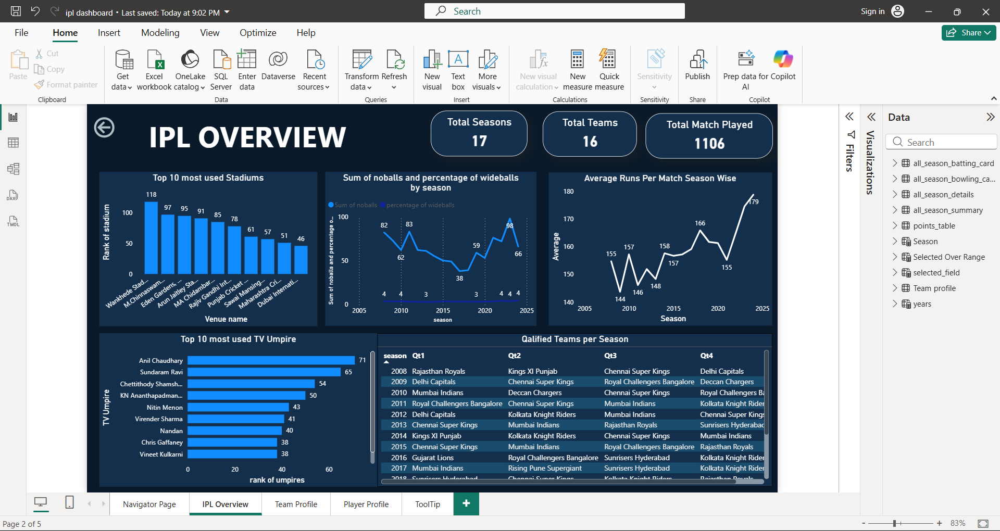

# IPL Data Analytics Dashboard — Power BI Portfolio


## Project preview



An end-to-end interactive Power BI dashboard built on IPL (Indian Premier League) data covering all seasons — featuring DAX measures, data modeling, Power Query transformations, and rich visual storytelling.

## How to explore this project

Since GitHub does not fully preview Power BI files, use the following options to review the work:

- 📊 **Quick preview:** Open the [`Screenshots/`](./Screenshots) folder to view all dashboard pages and technical views.
- 📁 **Explore files:** Browse the [`Learnings/`](./Learnings) folder for notes on concepts covered.
- ⬇️ **Download and open:** Download `ipl_dashboard.pbix` and open it in [Power BI Desktop](https://powerbi.microsoft.com/desktop/) (free) to interact with all visuals, slicers, and drill-throughs.

---

## What this repository demonstrates

- Real-world IPL dataset analysis across all seasons (2008–2024)
- End-to-end workflow: raw data → Power Query cleaning → data model → DAX → dashboard
- Business-focused data thinking with match, team, and player-level insights
- A fully developed interactive dashboard with slicers, drill-through, and custom tooltips

---

## Dashboard pages

### 1. Home / Overview

- Main landing page with navigation buttons
- High-level KPIs: total matches, total runs, total wickets, seasons covered

### 2. Season Summary

- Season-wise breakdown of matches, teams, and results
- Filter by year to see how each season played out

### 3. Match Analysis

- Toss decision impact — who won toss vs who won the match
- Venue-wise stats: matches played, average scores, win percentages

### 4. Team Performance

- Win/loss record for all franchises across seasons
- Head-to-head comparison using team slicers
- Points table for any selected season

### 5. Player Statistics

- Top run-scorers and top wicket-takers across seasons
- Orange Cap and Purple Cap highlights per season
- Individual player drill-through card with full career stats

---

## Technical highlights

### DAX Measures

- Wrote 20+ custom DAX measures including Win %, Strike Rate, Economy Rate, NRR, and boundary counts
- Used CALCULATE, FILTER, ALL, ALLEXCEPT, DIVIDE, and RANKX functions
- Created a dedicated measures table to keep the field list organised

### Data Model

- Connected Matches, Deliveries, Teams, and Players tables using one-to-many relationships
- Configured cross-filter direction carefully to avoid ambiguous relationships
- Built a Date table for time intelligence functions

### Power Query

- Removed nulls and blanks from ball-by-ball delivery data
- Extracted season year from match date column using a custom transformation
- Merged and appended queries to build a clean, analysis-ready dataset

### Slicers and Interactivity

- Season slicer using tile buttons for quick year selection
- Team and player dropdowns with cross-filtering across all visuals
- Bookmarks used for page navigation buttons and show/hide slicer panel
- Custom tooltips on player visuals showing extra stats on hover

---

## Key skills gained

- Power Query data cleaning and transformation
- Data modeling and relationship management
- DAX calculations for custom KPIs
- Dashboard design and layout best practices
- Drill-through pages and custom tooltips
- Bookmark-based navigation

---

## Repo structure

```
powerbi-data-analytics-portfolio/
│
├── ipl_dashboard.pbix
├── indian-premier-league-ipl-all-seasons.zip
│
├── Screenshots/
│   ├── READMEbanner.png
│   ├── 01_dashboard_home.png
│   ├── 03_season_summary.png
│   └── ...
│
├── Images/
│
├── Learnings/
│
└── README.md
```

---

## Tools used

- Microsoft Power BI Desktop
- Power Query (M language)
- DAX (Data Analysis Expressions)
- IPL all-seasons dataset (Matches + Deliveries CSV)

---

## Credits

This learning journey was guided by the course from **CampusX**:  
🔗 https://learnwith.campusx.in/

---

## What's next

- Move to **SQL for data querying**
- Learn **Python (Pandas, NumPy) for advanced analysis**
- Build projects combining **Python + Power BI**
- Work on **end-to-end data projects with real business problems**

---

## About the author

Rushit Tholiya — 2nd year B.Tech (Computer Science) at Nirma University, Ahmedabad

Currently building skills in data analysis and preparing for a career in **data science / data analytics**.

- [LinkedIn](https://linkedin.com/in/rushit-tholiya-605341311)
- [GitHub profile](https://github.com/Rushit004)
