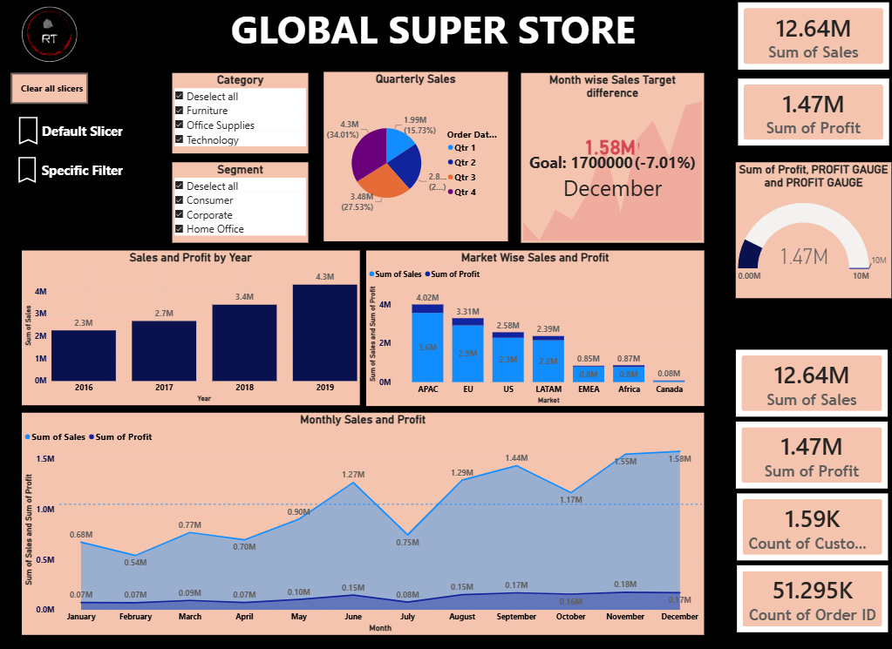
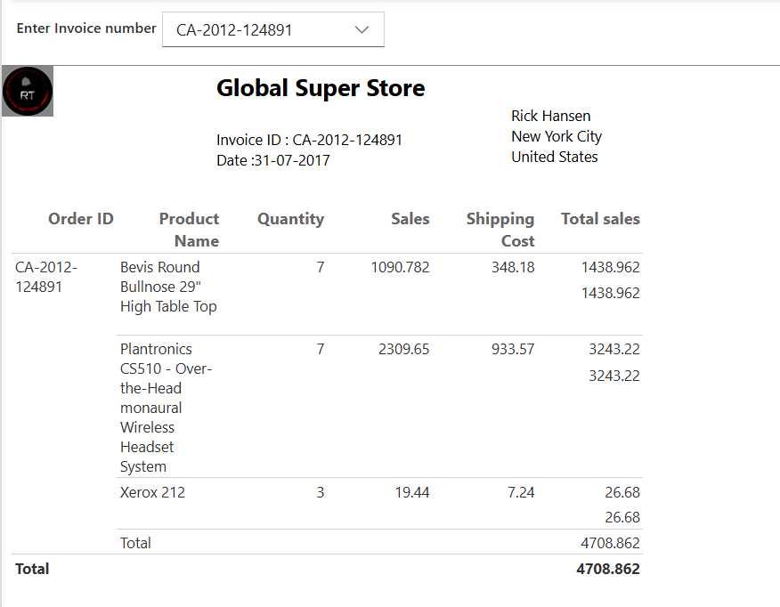

# Global Super Store — Power BI Analytics Dashboard


## Project Preview



An end-to-end Power BI analytics solution built on the Global Super Store dataset — a global retail dataset spanning **147 countries, 4 years (2016–2019), and over 51,000 orders**. The project takes the business from a raw multi-sheet Excel workbook all the way to a **15-page interactive dashboard**, a **parameter-driven paginated invoice report**, and a live deployment on Power BI Service — covering everything from executive KPIs to customer churn, ranking analytics, and AI-assisted decomposition.

## How to Explore this Project

Since GitHub can't render `.pbix` or `.rdl` files natively, here's how to review the work:

- 📊 **Quick preview:** Open the [`Screenshots/`](./Screenshots) folder for page-by-page exports of the dashboard.
- ⬇️ **Download and open:** Grab `globalsuperstore.pbix` and open it in [Power BI Desktop](https://powerbi.microsoft.com/desktop/) (free) to interact with all 15 pages, slicers, bookmarks, and parameters.
- 🖨️ **Explore the paginated report:** Open `Paginated report.rdl` in [Power BI Report Builder](https://powerbi.microsoft.com/report-builder/) (free) to see the invoice-style layout and its parameter logic.
- 🔒 **Why the live report isn't linked:** The dashboard is published to Power BI Service under an organizational workspace (used for coursework), which requires an institutional Microsoft login. Public/anonymous viewing isn't available for this type of workspace, so the PBIX and exports in this repo are the way to review the work.

---

## What this Project Demonstrates

- A complete Power BI workflow: raw Excel workbook → Power Query cleanup → a related data model → 30+ DAX measures → a 15-page interactive report → a parameter-driven paginated report → deployment to Power BI Service.
- Translating a written business brief (4 stakeholder groups, 6 sets of questions) directly into dashboard KPIs, charts, and slicers.
- Beyond-the-basics Power BI features: bookmarks, Field Parameters, What-if parameters, a custom tooltip page, conditional formatting, and a decomposition tree — not just standard bar/line charts.
- Extending the source dataset with a self-built customer demographic table (age, gender, marital status, income) to enable customer-segmentation analysis that the raw data didn't originally support.
- Advanced DAX patterns: cumulative totals, YoY growth, month-over-month contribution %, dynamic ranking, and churn/retention counts.

---


## Technical Highlights

### DAX Measures

The model includes a **dedicated measures table ("Table")** holding 28+ measures, plus several more defined directly on the `Orders` table — 30+ custom DAX measures in total, including:

- **Time intelligence:** `Cumulative sum`, `YOY growth`, `Avg Daily sales`, `monthly contribution`, `monthly contribution all select`, `relative context sales`, `all total sum`, `all selected total sum`
- **Ranking:** `Rank Country by sales`, `rank of country based on sales`, `rank of people`, `category sales rank`, `sales difference from top`
- **Customer analytics:** `Customer Churn Count`, `new customer`, `customer base`, `high_value_cust`, `High Value Orders Percentage`, `Avg Sales Value`
- **Product analytics:** `product contribution to profit`, `Most Sold Product`, plus product-specific counters (`Routers`, `keyboard`, `Headset`)
- **Targets/gauges:** `Monthly_target`, `Desired sales`, `PROFIT GAUGE`, `sales difference`

*(The measure names above are read directly from the report's field references. The exact DAX formula text lives inside Power BI's compressed data model file, which isn't extractable outside of Power BI Desktop — so names and usage are documented here rather than exact syntax.)*

### Data Model

The model is structured around an `Orders` fact table (51,290 rows) connected to:

- **`Customer`** — a table Rushit built and added himself (not part of the original Global Superstore dataset), holding synthetic demographic data (date of birth, gender, marital status, yearly income) joined via `Customer ID`, to enable the age/income/gender segmentation seen on Pages 6–7.
- **`People`** — the 13 regional sales managers, one per region, joined via `Region`, used in the Page 10 manager-ranking table.
- **`Returns`** — merged into `Orders` during Power Query (rather than kept as a separate related table) to produce the `Returned` flag column used on Page 13.
- Supporting **calculated/parameter tables** disconnected from the fact table: `Rank` and `profit slider` (What-if parameters), `X -axis` / `Y -axis` (Field Parameters), and `Retained Table` (a supporting table for the churn/retention measures).

The report currently relies on Power BI's automatic date hierarchy on `Order Date` rather than a dedicated calendar table — noted below under Future Improvements.

### Power Query

Based on the fields present in the model, data preparation included:

- Importing and shaping four source tables from the Excel workbook: `Orders`, `People`, `Returns`, and `Customer`.
- Merging `Returns` into `Orders` to flag each order as returned or not.
- Deriving calculated fields such as `weekday/weekend`, `delay_or_ontime`, `Age Category`, `Income Category`, `Age (bins)`, and a `Company` field (used for the Page 13 product/vendor breakdown).

*(As with the DAX layer, the exact M script isn't recoverable from the compressed PBIX outside of Power BI Desktop, so these steps are inferred from the resulting columns rather than the query code itself.)*

### Interactivity

- **Bookmarks:** three bookmarks on the executive page pre-set different Segment/Category slicer combinations for guided storytelling.
- **Field Parameters:** user-controlled X-axis/Y-axis selection on Page 12.
- **What-if parameters:** a Top-N rank selector and a profit-threshold slider driving dynamic tables.
- **Hierarchy drill-down:** date and geography hierarchies drillable on Page 4.
- **Custom tooltip page:** a dedicated hidden page used as a hover tooltip elsewhere in the report.
- **Conditional formatting:** rule-based fill/data-bar formatting is applied across most of the table-heavy pages (2, 3, 5–11, 13, and the parametrized-ranking page).
- **Decomposition tree:** an AI visual for open-ended, viewer-driven root-cause analysis of Total Sales.
- **Navigation buttons:** action buttons for page-to-page navigation throughout the report.

### Paginated Report

`Paginated report.rdl` was built in **Power BI Report Builder** as a print-ready, per-order **invoice**, connected live to the deployed `globalsuperstore` dataset on Power BI Service. It:

- Takes an `invoice_id` parameter (an Order ID picked from a dropdown of valid values).
- Renders a header with the Global Super Store logo, the invoice ID, and the order date.
- Shows the customer's name, city, and country.
- Lists line items (Product Name, Order ID, Quantity, Sales, Shipping Cost) with subtotals and a grand total.

This complements the interactive dashboard by solving a problem dashboards aren't good at: producing a single, formatted, printable/exportable document per record — something Power BI's canvas visuals can't do on their own.

---

## Key Skills Gained

- Power Query data preparation across multiple related Excel sheets, including merges to bring in returns data
- Building and connecting a custom demographic dimension table not present in the source data
- Writing 30+ DAX measures spanning time intelligence, ranking, churn, and contribution-percentage patterns
- Advanced interactivity: bookmarks, Field Parameters, What-if parameters, custom tooltip pages, and conditional formatting
- Designing a 15-page report architecture with consistent navigation
- Building a parameter-driven paginated (RDL) report in Power BI Report Builder
- Publishing and connecting a paginated report live to a dataset on Power BI Service
- Translating a written business requirements document directly into dashboard requirements

---

## Repository Structure

```
02_Global_Super_Store/
│
├── DataSet/
│ └── GlobalSuperstore.xlsx
│
├── Reports/
│ ├── globalsuperstore.pbix
│ └── Paginated report.rdl
│
├── Screenshots/
│ ├── 01_executive_overview.png
│ ├── 02_geographic_performance.png
│ ├── 03_sales_performance_by_regions_and_years.png
│ ├── 04_country_wise_sales_and_profit.png
│ ├── 05_shipping_timing_demographics.png
│ ├── 06_customer_segmentation.png
│ ├── 07_gender_high_value_customers.png
│ ├── 08_advanced_dax_ranking_cumulative.png
│ ├── 09_dynamic_field_parameters.png
│ ├── 10_most_profitable_products.png
│ ├── 11_dynamic_field_parameters_analysis.png
│ ├── 12_decomposition_tree.png
│ ├── 13_invoice_bill_using_paginated_report.png
│ └── READMEbanner.png
│
└── README.md


```

## Tools Used

- Microsoft Power BI Desktop
- Power Query (M language)
- DAX (Data Analysis Expressions)
- Power BI Report Builder (paginated/RDL reports)
- Power BI Service (deployment)
- Microsoft Excel (source workbook)

---

## Dataset Information

The **Global Super Store** dataset is a well-known retail analytics dataset packaged as a four-sheet Excel workbook:

| Sheet | Rows | Description |
|---|---|---|
| `Orders` | 51,290 | The core fact table — order, ship, customer, geography, product, and financial fields |
| `Returns` | 1,173 (1,172 unique orders) | Which orders were returned, by market |
| `People` | 13 | One regional sales manager per region |
| `Customer` | 1,590 | Added by Rushit — synthetic demographic data (date of birth, marital status, date of first purchase, gender, yearly income) to support customer-segmentation analysis |

Coverage: **2016–2019**, **147 countries**, **7 markets** (APAC, EU, US, LATAM, EMEA, Africa, Canada), **13 regions**, **3 categories** (Furniture, Office Supplies, Technology) across **17 sub-categories**, and **3 customer segments** (Consumer, Corporate, Home Office).

---

## Key Business Insights

- The business generated **$12.64M in total sales and $1.47M in profit** (an 11.6% overall margin) across 25,035 orders and 1,590 customers between 2016 and 2019.
- **APAC** is the top-performing market by both sales ($3.59M) and profit ($436K), followed by EU and US; **Canada** is by far the smallest market (~$67K in sales).
- **Technology** is the most profitable category ($663.8K profit) even though Furniture generates comparable sales — Furniture's profit lags well behind both Technology and Office Supplies.
- The **Tables** sub-category is a red flag: it brings in ~$757K in sales but is **profit-negative overall (-$64K)** — a classic margin-erosion pattern worth investigating (likely tied to heavy discounting).
- **Consumer** is the leading segment, contributing roughly half of total sales and profit.
- Sales grew every year, from **$2.26M (2016) to $4.30M (2019)** — nearly doubling over four years, with the sharpest year-over-year jump between 2017 and 2018 (+27%).
- About **4.68% of all orders were returned**, based on the Returns sheet.
- **Standard Class** shipping averages ~5 days, roughly double **Second Class** (~3.2 days) and far slower than **Same Day** delivery — a potential lever for customer satisfaction improvements.
- The **top 5 countries by sales** are the United States, Australia, France, China, and Germany, with the US alone contributing roughly 18% of total company sales.

---

## Challenges Faced

- **Customer identity ambiguity:** the source data has 795 customer names that map to two different Customer IDs each (e.g., two separate "Rick Hansen" records) — joining the custom demographic table correctly required keying strictly off Customer ID rather than name.
- **Filter-context control in DAX:** the YoY growth and monthly/all-selected contribution measures required careful use of `ALL`/`ALLSELECTED`-style patterns to avoid double-counting or context collapse across 15 interconnected pages.
- **Merging Returns without duplicating rows:** bringing the 1,172-order Returns sheet into the 51,290-row Orders fact table needed a clean one-to-many merge to avoid inflating sales/profit totals.
- **No dedicated Date table:** relying on Power BI's automatic date hierarchy works for the visuals built here, but makes some time-intelligence patterns more fragile than they'd be with a proper calendar table (see below).
- **Coordinating a 15-page report:** keeping navigation, slicers, and bookmark states consistent across that many pages is a real design challenge distinct from building any single visual.

---

## Future Improvements

- Add a dedicated, disconnected Date/Calendar table to make time-intelligence measures more robust and hierarchy-independent.
- Document and formalize the model's relationships (a written data dictionary alongside the PBIX).
- Apply row-level security so each regional manager (from the `People` table) sees only their own region's data.
- Add screenshots or a short GIF walkthrough of the report so the dashboard is viewable directly from GitHub.
- Extend the paginated report to support batch invoice generation or a subscription/email delivery schedule.
- Revisit the hidden Python-visual practice page — either remove it or turn it into a properly documented, integrated part of the analysis.

---

## About the Author

**Rushit Tholiya** — 3rd year B.Tech (Computer Science) at Nirma University, Ahmedabad.

Currently building skills in data analysis and data science, working through a structured Power BI → SQL → Python roadmap toward a career in **data science / data analytics**.

- [LinkedIn](https://linkedin.com/in/rushit-tholiya-605341311)
- [GitHub profile](https://github.com/Rushit004)