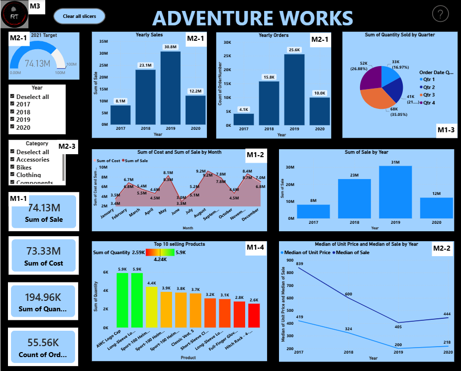
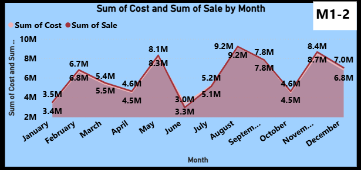
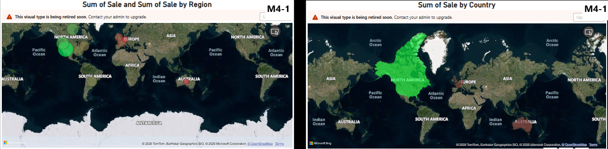
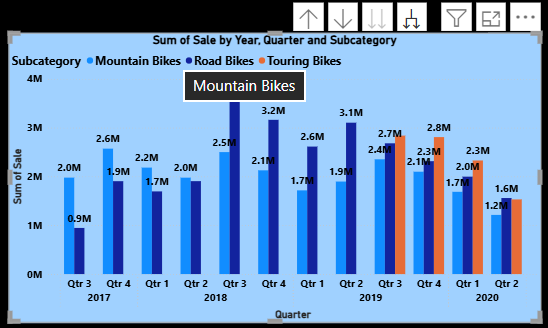
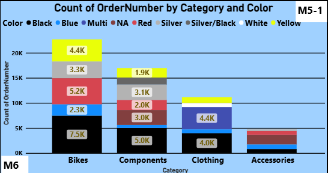
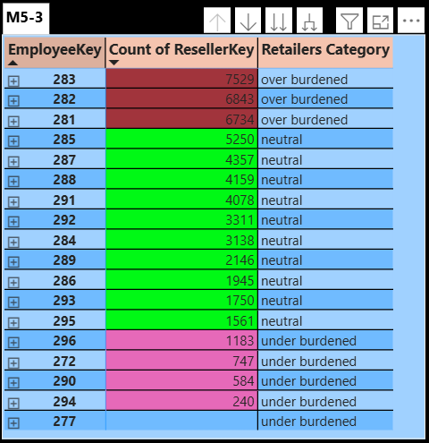
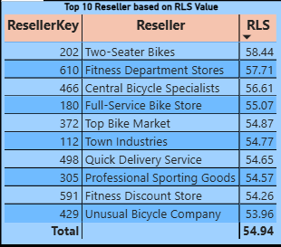
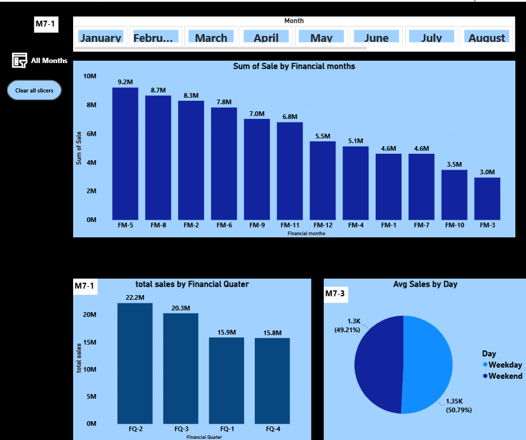
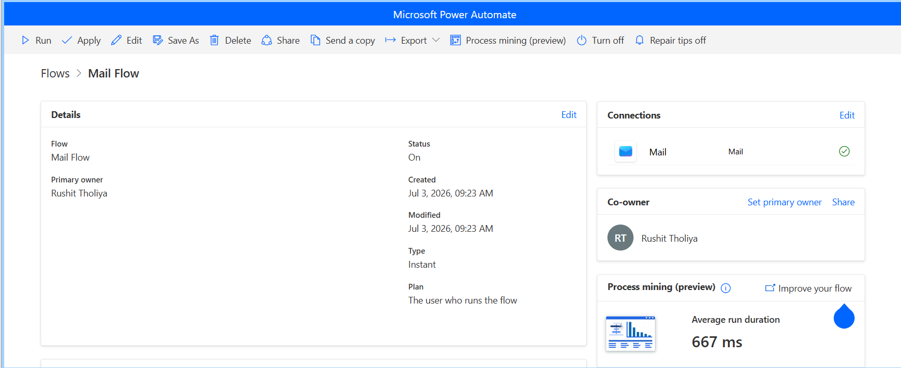

# Adventure Works Sales — Power BI Portfolio


## Project preview



An end-to-end interactive Power BI dashboard built for **Adventure Works**, a retail client, based on a real client-brief style case study delivered across multiple stakeholder mail requests (Sales, Reseller, Employee, and Financial datasets) — featuring 25+ DAX measures, star-schema data modeling, Power Query transformations, multi-page visual storytelling, and a **Power Automate–driven "email me the report" flow** triggered straight from the dashboard.

## How to explore this project

Since GitHub does not fully preview Power BI files, use the following options to review the work:

- 📊 **Quick preview:** Open the [`Screenshots/`](./Screenshots) folder to view all dashboard pages.
- 📁 **Explore requirements:** See [`Adventure Works.pdf`](./Report/Adventure%20Works%20.pdf) for the full client brief (Mail 1–9) this dashboard was built against.
- ⬇️ **Download and open:** Download `Adventure Works.pbix` from the [`Report/`](./Report) folder and open it in [Power BI Desktop](https://powerbi.microsoft.com/desktop/) (free) to interact with all visuals, slicers, and drill-throughs.

---

## What this repository demonstrates

- A simulated real-world client engagement: requirements delivered incrementally across 9 stakeholder "mails," each adding new pages, datasets, and asks
- End-to-end workflow: raw multi-source data (Sales, Reseller, Salesperson, Targets) → Power Query cleaning → star-schema data model → DAX → dashboard
- Business-focused data thinking across sales, reseller, employee, and financial performance
- A fully developed 7-page interactive dashboard with slicers, bookmarks, custom navigation, and dynamic KPI tracking
- A no-code automation layer: an in-report button that triggers a **Power Automate flow** to email a live sales summary on demand

---

## Dashboard pages

### 1. Sales Overview


- KPI cards: total sales, total costs, total orders, total quantity sold
- Month-by-month sales vs. cost trend, designed to visually flag months where cost < sales
- Quantity sold per quarter across years ([screenshot](Screenshots/03_quantity_by_quarter.png))
- Top 10 selling products per year, with consistency across years highlighted ([screenshot](Screenshots/04_top10_products_yearly.png))
- Fixed (non-interactive) card showing total sales & total orders at a glance
- Gauge tracking progress toward the **$100M 2021 sales target** (2016–2021 strategic plan) ([screenshot](Screenshots/05_sales_target_gauge_2021.png))
- Yearly sales trend and median unit price vs. median sales price trend ([screenshot](Screenshots/06_yearly_sales_median_price_trend.png))
- All visuals dynamically respond to a product category slicer
- Adventure Works logo linking out to an external course reference
- A **Clear Slicers** button added proactively so users never get stuck on a filtered view

### 2. Regional & Reseller Map Analysis


- Bubble map: sales by region (bubble size = sum of sales)
- Color-coded map: country-regions bucketed by sales volume (red < ₹1cr, brown ₹1–5cr, green > ₹5cr)
- Sales & quantity sold by reseller type, tracked annually ([screenshot](Screenshots/08_reseller_type_yearly_trend.png))
- Quantity sold by country-region shown as a percentage relative to the top-performing region, set to 100% ([screenshot](Screenshots/09_quantity_vs_top_performer.png))

### 3. Bike Category Analysis


- Sales performance within the bike segment sliced by year, quarter, month, and day
- Time-granularity slicer to move fluidly between annual and daily views

### 4. Colour & Geographic Sales


- Article count sold by colour, broken down per product category
- Sales and cost per state, shown as bar charts

### 5. Reseller Distribution & Drilldown


- Reseller distribution by region and reseller type, benchmarked against the 2016 target trajectory
- Quantity sold by group and country, with drillthrough restricted to countries within the selected group only
- Cross-page navigation button: clicking the "components" segment of the colour chart drills through to the Page 1 sales/cost visuals, pre-filtered to the **Components** category

### 6. Employee Workload & Reseller Loyalty


- Top 10 resellers ranked by a custom **Reseller Loyalty Score (RLS)**:
  `RLS = ((0.50 × Total Sales) + (0.20 × Duration of Association) + (0.10 × Quantity) + (0.20 × Profit) / Total Sales) × 100`
- Employee workload classification table — under-burdened (pink, <1500 retailers), balanced (green, 1500–6000), overburdened (red, >6000) — sorted with under-burdened employees first
- Cities ranked 5th–15th by reseller count
- Reseller distribution per employee across countries

### 7. Financial Performance & KPIs


- Sales and cost by financial quarter and financial month
- Employee target fulfilment percentage (e.g., 3 of 4 weekly targets met = 75%)
- Average sales & average quantity: weekend vs. weekday comparison
- 2019 cumulative monthly sales with each month's % contribution to the year
- Sales representative contribution to total yearly sales, by percentage
- Year-over-year deviation of actual sales vs. target sales, tracked against the strategic target trajectory ([screenshot](Screenshots/15_targetwise_sales_analysis.png))
- Colour grouping (Group A/B/C) with sales aggregated per group
- Cross-check of overburdened sales reps against their actual performance

---

## Bonus: Automated Sales Report via Power Automate


Beyond the interactive report, the dashboard includes a **"Send Sales Report" button** wired to a Power Automate flow, so anyone viewing the report can get a live sales summary delivered straight to their inbox without opening Power BI Desktop or a service workspace.

- A button on the report triggers a Power Automate flow via the **Power BI button visual → Power Automate** connector
- The flow pulls the current sales summary and emails it to the requester on demand
- Received email confirmation showing the automated report delivery: ([screenshot](Screenshots/17_recieved_mail.png))

This closes the loop between "insight in the dashboard" and "insight in your inbox" — useful for stakeholders who want a quick pulse-check without navigating the full report.

---

## Technical highlights

### DAX Measures
- Wrote 25+ custom DAX measures including RLS score, target fulfilment %, YoY sales deviation, cumulative sales, weekday/weekend averages, and rep-level sales contribution %
- Used `CALCULATE`, `FILTER`, `ALL`, `ALLEXCEPT`, `DIVIDE`, `RANKX`, and time-intelligence functions for financial calendars
- Built conditional classification measures (workload status, colour grouping, region-sales buckets) using nested `SWITCH`/`IF` logic
- Created a dedicated measures table to keep the field list organised

### Data Model
- Connected Sales, Reseller, Salesperson, SalespersonRegion, and Target tables using one-to-many relationships
- Configured cross-filter direction carefully to avoid ambiguous relationships across the multi-fact model
- Built a Date table (including a financial calendar) to support standard and financial-year time intelligence

### Power Query
- Cleaned and merged Reseller.csv, Sales.xlsx, Salesperson.xlsx, SalespersonRegion.xlsx, and target.csv into an analysis-ready model
- Extracted financial quarter/month attributes from transaction dates
- Applied conditional column logic for workload and sales-volume bucketing at the query layer where appropriate

### Slicers, Navigation & Interactivity
- Category slicer driving every visual on the Sales Overview page
- Time-granularity slicer for the Bike Category Analysis page
- Bookmark- and button-based drillthrough: colour-by-category chart → Sales Overview filtered to "Components"
- A dedicated **Clear Slicers** button on every page to prevent filter lock-in for end users
- Clickable Adventure Works logo linking to an external resource
- Group-scoped drillthrough restricting navigation to relevant countries only

### Automation
- Power BI **button visual** integrated with **Power Automate** to trigger an on-demand email flow
- Flow packages the current sales summary and sends it to the requesting user's inbox
- Demonstrates connecting Power BI to the wider Power Platform (Power Automate) beyond native report features

---

## Key skills gained
- Translating open-ended, incrementally delivered client requirements into a structured dashboard scope
- Power Query data cleaning and multi-source merging
- Star-schema data modeling and relationship management
- Advanced DAX for custom scoring formulas (RLS), targets, and time intelligence
- Dashboard UX: fixed vs. dynamic visuals, gauge-based goal tracking, bucketed classification tables
- Drill-through and cross-page filtered navigation
- Bookmark-based interactivity and slicer management
- No-code automation with Power Automate, integrated directly into a Power BI report

---

## Repo structure

```
03_adventure_works/
│
├── Datasets/
│   ├── Reseller.csv
│   ├── Sales.xlsx
│   ├── Salesperson.xlsx
│   ├── SalespersonRegion.xlsx
│   ├── target.csv
│   └── Targets.docx
│
├── Report/
│   └── Adventure Works.pbix
│
├── Screenshots/
│   ├── 01_dashboard_overview.png
│   ├── 02_sales_vs_cost_trend.png
│   ├── 03_quantity_by_quarter.png
│   ├── 04_top10_products_yearly.png
│   ├── 05_sales_target_gauge_2021.png
│   ├── 06_yearly_sales_median_price_trend.png
│   ├── 07_sales_by_country_region_map.png
│   ├── 08_reseller_type_yearly_trend.png
│   ├── 09_quantity_vs_top_performer.png
│   ├── 10_bike_category_analysis.png
│   ├── 11_color_preference_by_category.png
│   ├── 12_reseller_distribution_employee_workload.png
│   ├── 13_sales_by_financial_quaters_and_months.png
│   ├── 14_top10_resellers_based_on_RLS.png
│   ├── 15_targetwise_sales_analysis.png
│   ├── 16_mail_flow_using_power_automate.png
│   ├── 17_recieved_mail.png
│   └── READMEbanner.png
│
├── Adventure Works .pdf
└── README.md
```

## Tools used
- Microsoft Power BI Desktop
- Power Query (M language)
- DAX (Data Analysis Expressions)
- Power Automate (button-triggered email flow)
- Adventure Works sales, reseller, and salesperson datasets (CSV/XLSX)

---

## Project brief

This dashboard was built end-to-end from a phased client brief (Mail 1 through Mail 9), starting with core sales KPIs and progressively expanding to reseller mapping, bike-category deep dives, employee workload analysis, and financial-quarter reporting — mirroring how real BI requirements evolve over a client engagement. Full brief: [`Adventure Works.pdf`](./Adventure%20Works%20.pdf).

## About the author

Rushit Tholiya — 3rd year B.Tech (Computer Science) at Nirma University, Ahmedabad

Currently building skills in data analysis and preparing for a career in **data science / data analytics**.

- [LinkedIn](https://linkedin.com/in/rushit-tholiya-605341311)
- [GitHub profile](https://github.com/Rushit004)