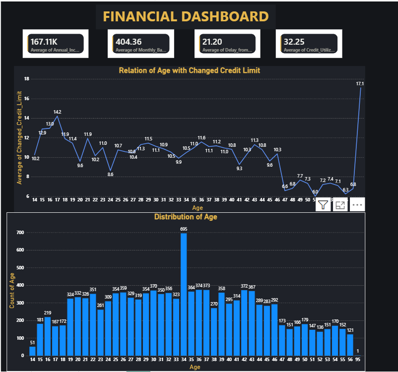
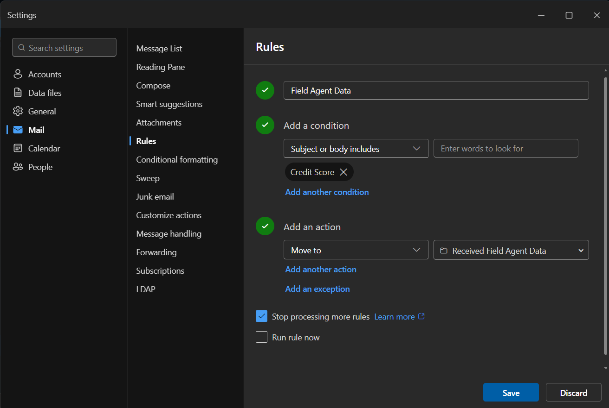
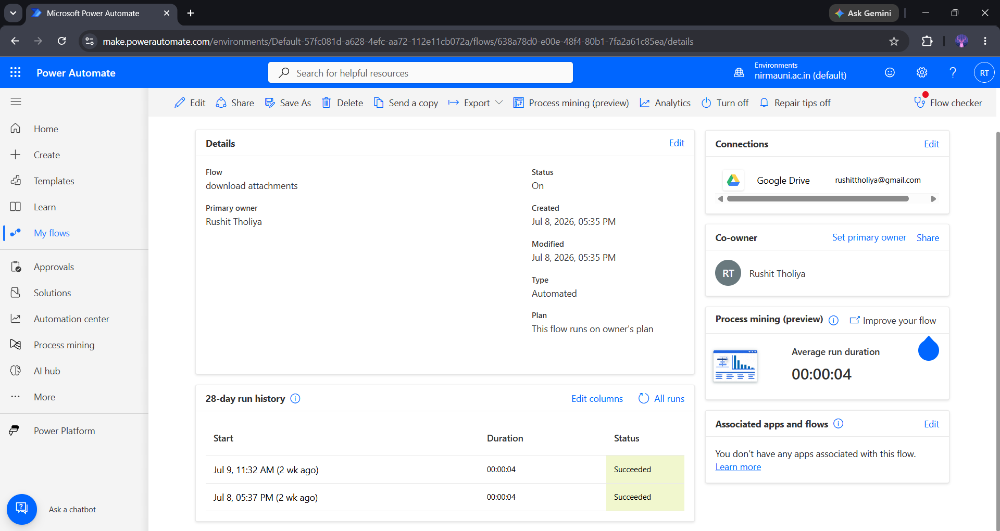
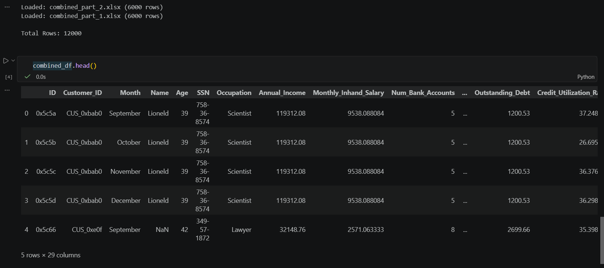
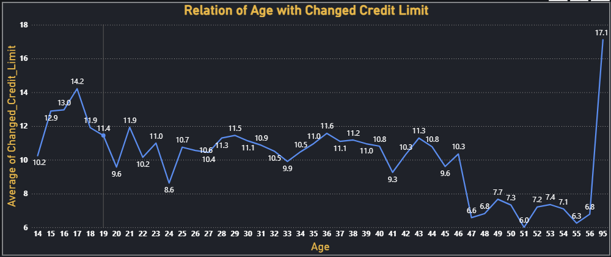
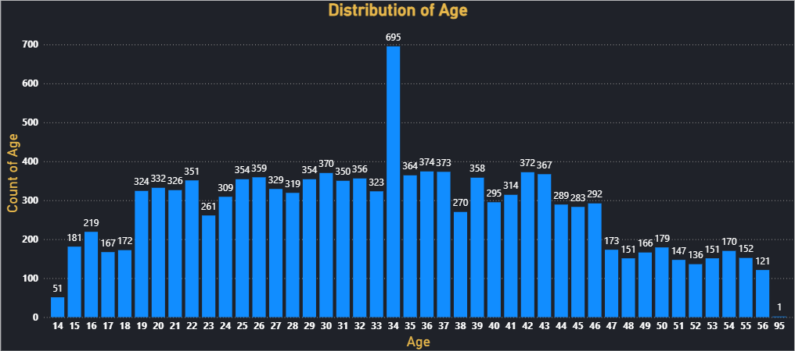
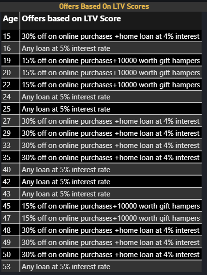

# Financial Dashboard — Power BI + Python Automation Portfolio


## Project preview



An end-to-end Power BI dashboard for a **US government financial/credit-risk analysis client**, where the primary deliverable wasn't just the report — it was **automating a manual, error-prone, 5-hour daily data pipeline** using Outlook rules, Power Automate, and a Python + Google Drive API notebook, so the client's team could stop losing hours (and $12,000/month in extra headcount) to file wrangling before 8pm every day.

## How to explore this project

Since GitHub does not fully preview Power BI files, use the following options to review the work:

- 📊 **Quick preview:** Open the [`Screenshots/`](./Screenshots) folder to view the dashboard pages and the automation in action.
- 🐍 **Automation notebook:** See [`Automation/fetch_and_combine.ipynb`](./Automation/fetch_and_combine.ipynb) — the Python notebook that pulls, merges, and cleans the daily files from Google Drive.
- 📁 **Explore requirements:** See [`Financial Dashboard.pdf`](./Financial%20Dashboard.pdf) for the full client brief (Mail 1–2) this project was built against.
- ⬇️ **Download and open:** Download `Financial_Project.pbix` from the [`Report/`](./Report) folder and open it in [Power BI Desktop](https://powerbi.microsoft.com/desktop/) (free) to interact with all visuals.

---

## What this repository demonstrates

- Identifying and solving a real operational bottleneck, not just building visuals on top of clean data
- A 3-stage automation pipeline (Outlook → Power Automate → Python/Drive) that eliminates manual file downloading, combining, and the errors that came with doing it by hand
- Business-focused credit-risk analytics: age demographics, credit utilisation, payment behaviour, and a custom Lifetime Value (LTV) scoring model
- A 4-page interactive Power BI dashboard built on the now-automated, always-fresh dataset

---

## The problem

The client's team manually handled ~25 files arriving by email every day at 3pm from a distributed survey team, and had to download, merge, clean, and turn them into a finished dashboard by 8pm the same day for the US government client. This was:

- **Slow** — most of the team's time went to downloading, combining, and cleaning files rather than analysis
- **Expensive** — two extra hires were brought on just to keep up, at $12,000/month
- **Error-prone** — manual merging introduced frequent data errors
- **Disruptive** — the workload was bleeding into other projects and hurting overall efficiency

## The automation

The manual "download from email → merge by hand" workflow was replaced with a 3-stage automated pipeline:

**1. Outlook rule — isolate the survey team's mail**

An Outlook rule automatically detects incoming survey-team emails and routes them into a dedicated folder, keeping the ~25 daily files separate from the rest of the inbox. ([separated inbox view](Screenshots/10_seperated_mails.png))

**2. Power Automate — download attachments and push to Drive**

A Power Automate flow watches that folder, automatically downloads every attachment as soon as it lands, and uploads it straight to a shared Google Drive folder — no one has to open a single email. ([attachments landing in Drive](Screenshots/12_attachments_uploaded_to_drive.png))

**3. Python notebook — pull from Drive, merge, and clean**

[`fetch_and_combine.ipynb`](./Automation/fetch_and_combine.ipynb) then takes over:
- Authenticates with a Google service account (read-only scope) — no manual login required
- Lists every file in the shared Drive folder automatically
- Downloads and reads each file in-memory (supports Google Sheets, CSV, and XLSX) using `MediaIoBaseDownload` and `pandas`
- Tags each row with its `source_file` so lineage is never lost during merging
- Concatenates every file into a single clean DataFrame, ready to feed straight into Power BI
- Wraps every file read in a try/except so one bad file logs an error and gets skipped, instead of breaking the entire pipeline

This directly answered the client's four asks: **less time**, **fewer errors**, **lower cost** (no more $12,000/month in extra hires), and **less workload spillover** into other projects.

---

## Dashboard pages

### 1. Portfolio Overview


- KPI cards: Average Annual Income, Average Monthly Balance, Average Number of Delays in Payment, Average Credit Utilisation
- Supporting trend visual giving a headline view of the customer base at a glance

### 2. Credit Behaviour & Age


- Relationship between customer age and changes in credit limit, to see whether credit limit adjustments correlate with age
- Payment behaviour broken down by credit mix category ([screenshot](Screenshots/03_payment_behavior_by_credit_mix.png))

### 3. Age Segmentation & Risk Profile


- Age distribution plot across the full customer base
- Customer counts by credit score, segmented into custom age bands: **Teen (14–19), Young Adult (19–25), Old Adult (25–35), Old1 (35–45), Old2 (45+)** ([screenshot](Screenshots/05_credit_score_by_age_group.png))
- Frequency of payment behaviours within each credit mix category
- Identification of potential loan customers by age group, narrowed further to age groups with an average credit enquiry count above 7.5 ([screenshot](Screenshots/06_potential_customer_age_group_inquiry.png))

### 4. LTV Scoring & Loan Insights


- Custom **Lifetime Value (LTV)** score per age group:
  `LTV = (0.3 × Avg Annual Income) − (0.15 × Avg Days in Payment Delay) + (0.4 × Avg Credit Score) + (0.075 × Avg Amount Invested) + (0.075 × Avg Monthly Balance)`
- Promotion tiers rolled out automatically based on LTV thresholds (30% off + 4% home loan / 15% off + gift hampers / 5% interest loan)
- Average number of loans and credit cards held, broken down by age
- Count of each loan type disbursed to date, to track which products are most popular ([screenshot](Screenshots/08_loan_type_distribution.png))

---

## Technical highlights

### Automation (Outlook + Power Automate + Python/Google Drive API)
- Outlook rule to auto-triage incoming survey-team emails into a dedicated folder
- Power Automate flow to detect new mail in that folder, download attachments, and upload them to Google Drive — fully hands-off between 3pm arrival and dashboard build
- Service-account authentication (`google.oauth2.service_account`) with a read-only Drive scope — no credentials handled manually in day-to-day use
- `googleapiclient.discovery.build` + `MediaIoBaseDownload` to stream files directly into memory as `BytesIO` buffers
- Branch logic to handle native Google Sheets (exported as CSV) vs. uploaded CSV/XLSX files differently
- `pandas.concat` to merge all daily files into a single analysis-ready DataFrame, tagged by `source_file`
- Error handling per file so the pipeline degrades gracefully instead of failing outright

### DAX Measures
- Wrote custom DAX measures for average annual income, average monthly balance, average payment delay, average credit utilisation, and the LTV score
- Used `CALCULATE`, `AVERAGEX`, `SWITCH`, and conditional logic to build age-band segmentation and credit-score-to-numeric mapping (Good = 3, Bad = 0)
- Built promotion-tier logic directly in DAX based on LTV thresholds

### Data Model
- Modeled the combined customer/credit dataset with calculated age-group and credit-mix categorisation columns
- Structured relationships to support cross-filtering between age, credit mix, and loan-type visuals

### Power Query
- Standardised schema across daily source files before they hit the model
- Cleaned inconsistent column naming and types introduced by manual survey submissions

---

## Key skills gained
- Diagnosing an operational bottleneck and designing an automation-first solution, not just a dashboard
- Chaining Outlook rules, Power Automate, and a Python/Drive API script into one end-to-end pipeline
- Google Drive API integration and service-account authentication in Python
- Building resilient ETL notebooks with per-file error handling
- Advanced DAX for custom scoring models (LTV) and segmentation logic
- Credit-risk-style analytics: age demographics, payment behaviour, credit utilisation
- Translating a cost/time/error business problem into a measurable technical solution

---

## Repo structure

```
05_financial_dashboard/
│
├── Automation/
│   └── fetch_and_combine.ipynb
│
├── Data/
│   ├── combined_part_1.xlsx
│   ├── combined_part_2.xlsx
│   ├── ...
│   └── combined_part_25.xlsx
│
├── Report/
│   └── Financial_Project.pbix
│
├── Screenshots/
│   ├── 01_dashboard_overview.png
│   ├── 02_credit_limit_vs_age.png
│   ├── 03_payment_behavior_by_credit_mix.png
│   ├── 04_age_distribution_plot.png
│   ├── 05_credit_score_by_age_group.png
│   ├── 06_potential_customer_age_group_inquiry.png
│   ├── 07_LTV_score_promotions_table.png
│   ├── 08_loan_type_distribution.png
│   ├── 09_outlook_rules_seperate_client_mail.png
│   ├── 10_seperated_mails.png
│   ├── 11_power_automate_flow_download_attachments.png
│   ├── 12_attachments_uploaded_to_drive.png
│   ├── 13_preview_of_combined_files.png
│   └── READMEbanner.png
│
├── .gitignore
├── Financial Dashboard.pdf
└── README.md
```


## Tools used
- Microsoft Power BI Desktop
- Microsoft Outlook (mail rules)
- Power Automate (attachment download → Drive upload flow)
- Python (`pandas`, `google-api-python-client`, `google-auth`) via Jupyter Notebook
- Google Drive API (service account, read-only scope)
- DAX (Data Analysis Expressions)
- Power Query (M language)

---

## Project brief

This project was built end-to-end from a two-stage client brief: Mail 1 described the manual pipeline's cost, time, and error problems and asked for an automation solution; Mail 2, sent after the automation was live, laid out the full set of credit-risk and demographic visuals for the dashboard itself. Full brief: [`Financial Dashboard.pdf`](./Financial%20Dashboard.pdf).

## About the author

Rushit Tholiya — 3rd year B.Tech (Computer Science) at Nirma University, Ahmedabad

Currently building skills in data analysis and preparing for a career in **data science / data analytics**.

- [LinkedIn](https://linkedin.com/in/rushit-tholiya-605341311)
- [GitHub profile](https://github.com/Rushit004)